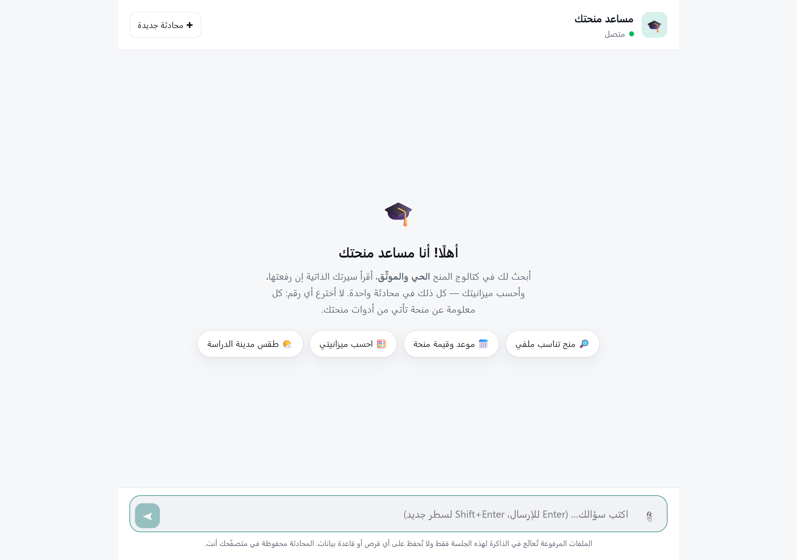
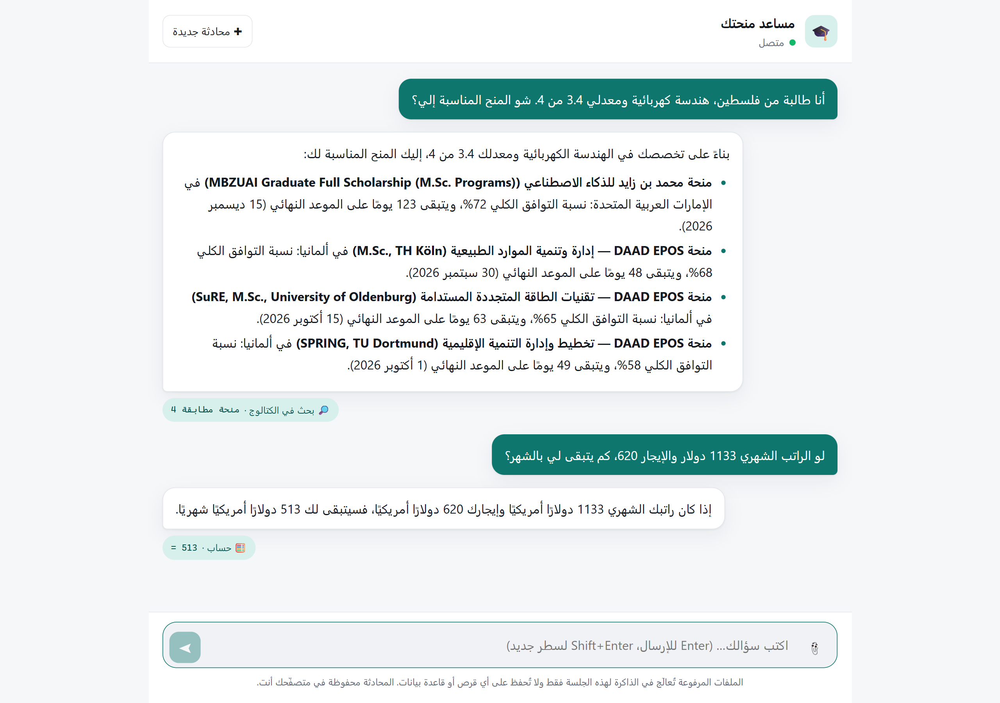
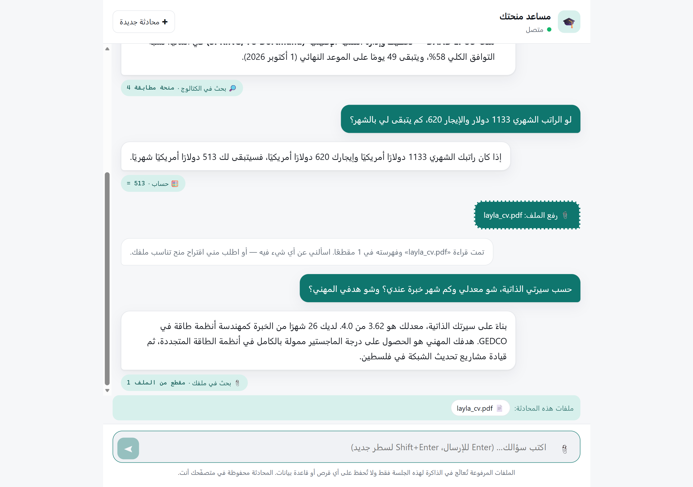
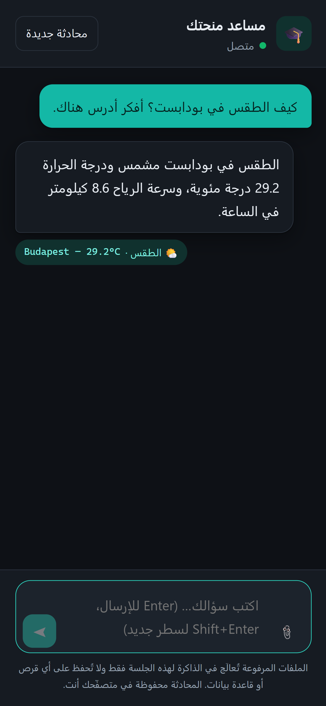

# 🎓 مساعد منحتك — minhtak Assistant

A production-deployed Arabic AI assistant that **chats, calls real tools, reads your PDF,
and remembers the conversation** — one interface over a live, human-verified scholarship
catalogue.

**▶ Live app: https://minhtak-assistant.fly.dev**


---

## Project overview

This is the capstone that unifies the earlier tasks of the programme — a chatbot, a
tool-calling agent, and a RAG pipeline — into **one assistant** rather than three demos
sitting in one folder.

The unification is architectural, not cosmetic: **retrieval over the user's uploaded PDF
is exposed to the model as a fifth tool.** The assistant is not "a chatbot with a RAG mode"
— it is one agent that decides, per question, whether the answer lives in the live
scholarship catalogue, in the student's own CV, in the weather service, or in a
calculation. One conversation, one memory, one set of grounding rules.

It is built on top of [minhtak.com](https://minhtak.com), a real scholarship-matching
platform for Arab students, and it talks to that platform's **live public API** — so the
deadlines and funding amounts it quotes are the same verified records real users see.

## 🎯 Objectives

- Combine chat, conversation history, tool calling, PDF upload and RAG into a single
  production application.
- Keep the assistant **grounded**: every scholarship fact comes from a tool, never from
  the model's memory.
- Make the reasoning **auditable** — the UI shows which tools ran and what they returned.
- Handle failure like production software: typed errors, honest messages, no stack traces
  in the chat window, no invented answers when a tool fails.
- Deploy it, publicly, on a URL anyone can open.

## ✨ Features

| Requirement | How it is implemented |
|---|---|
| **Chat interface** | Arabic-first RTL single-page client, streamed-feel typing indicator, suggestion chips, keyboard-first composer (Enter to send, Shift+Enter for a newline) |
| **Conversation history** | Server keeps the model-facing turns per session (bounded + trimmed at a safe turn boundary); the browser keeps the visible transcript in `localStorage` so a refresh resumes |
| **Tool calling** | 5 tools with Gemini function calling in `AUTO` mode — the model chooses, chains and re-plans; a visible trace chip is rendered for every call |
| **PDF upload** | Multipart upload with type/size/page caps and typed rejections (`415`, `413`, `422`) |
| **RAG** | PDF → text → overlapping chunks → Gemini embeddings → in-memory cosine index → top-k retrieval, exposed to the agent as `search_uploaded_documents` |
| **Error handling** | One typed error family mapped to HTTP codes and Arabic user messages; tool failures are returned *to the model* so it can recover mid-conversation |
| **Modern UI** | Dependency-free design system, light **and** dark themes, responsive to 390 px, accessible landmarks |

### The five tools

| Tool | What it does | Source of truth |
|---|---|---|
| `search_scholarships` | Ranked matches for a student profile | Live منحتك API |
| `get_scholarship_details` | Funding breakdown, all deadlines, official link | Live منحتك API |
| `search_uploaded_documents` | Top-k passages from the user's PDFs | This session's RAG index |
| `get_weather` | Current conditions in a study destination | Open-Meteo |
| `calculate` | Safe arithmetic (AST-walked, no `eval`) | Local |

`search_uploaded_documents` is **declared only when the session actually has a document**.
Advertising a tool the session cannot serve invites the model to call it and then explain
an error to the user — a self-inflicted failure.

## 🏗️ How a turn works

```
user message
   └─> POST /api/chat  (session id resolves the history + the document index)
         └─> Gemini, given the tool declarations, decides
               ├─ answer directly ─────────────────────────────> reply
               └─ call tool(s)
                     ├─ search_scholarships ──> live منحتك API
                     ├─ search_uploaded_documents ──> session RAG index
                     ├─ get_weather / calculate
                     └─ results fed back in ONE turn ──> Gemini decides again
                                                          (loops, max 8 steps)
   <─ reply + trace[] + documents[]  ─────────────────────────────┘
```

Running out of steps **raises** instead of returning a guess. An assistant that invents an
answer after failing to use its tools is worse than one that admits it could not finish.

## 🧰 Technologies and frameworks

| Tool | Role |
|---|---|
| **Google Gemini** `gemini-2.5-flash` | The agent: function calling in `AUTO` mode |
| **Google Gemini** `gemini-embedding-001` | 768-dim embeddings for retrieval (task-typed: `RETRIEVAL_DOCUMENT` vs `RETRIEVAL_QUERY`) |
| **FastAPI + Uvicorn** | JSON API and static hosting in one process |
| **pypdf** | PDF text extraction |
| **NumPy** | Cosine similarity over the in-memory index |
| **httpx** | HTTP to Gemini, the منحتك API and Open-Meteo |
| **Vanilla JS/CSS** | The client — no build step, no framework, no CDN |
| **Docker + Fly.io** | Single-container deploy in `fra` |

## 🔒 Privacy posture

An uploaded CV is personal data, so the app is built not to become its custodian:

- Documents are parsed, embedded and indexed **in memory**, inside the session that
  uploaded them. Nothing is written to a disk or a database.
- Sessions expire on idle (1 h default) and vanish on restart.
- The visible transcript lives in **your** browser's `localStorage`, not on the server.
- "محادثة جديدة" deletes the server session immediately rather than waiting for the TTL.

The UI states this under the composer, because a promise the user cannot see is not a
promise.

## ⚖️ A trade-off worth naming: one machine

Sessions live in process memory, so the app runs on **exactly one Fly machine**
(`fly scale count 1`) and **one Uvicorn worker**.

Fly's default is a two-machine HA pair, and it round-robins requests — which would look to
a user like the assistant randomly forgetting the CV they just uploaded. Scaling
horizontally would mean moving sessions into a shared store (Redis) and the vectors into a
real vector database. For this scale, one machine with bounded, expiring sessions is the
honest choice; the ceiling is documented rather than hidden.

Both bounds are enforced in code: `MAX_SESSIONS` (oldest-first eviction) and
`SESSION_TTL_SECONDS` (idle expiry).

## 🚀 Installation and setup

```bash
git clone https://github.com/abdelrahmanAdwan/minhtak-assistant-.git
```

```bash
cd minhtak-assistant- && pip install -r requirements.txt
```

Get a free Gemini key at [aistudio.google.com/apikey](https://aistudio.google.com/apikey),
then:

```bash
cp .env.example .env
```

```ini
GEMINI_API_KEY=your-key-here
```

## ▶ How to run

```bash
uvicorn app.main:app --reload --port 8000
```

Open `http://localhost:8000` — the API serves the web client from the same origin, so
there is no CORS to configure and no second server to start.

### Deploy your own

```bash
fly launch --no-deploy && fly secrets set GEMINI_API_KEY=your-key && fly deploy --remote-only
```

```bash
fly scale count 1
```

The second command is not optional — see the trade-off section above.

## 🔌 API

| Method | Path | Purpose |
|---|---|---|
| `POST` | `/api/session` | Start a conversation |
| `GET` | `/api/session/{id}` | What the server still remembers |
| `DELETE` | `/api/session/{id}` | Forget everything, documents included |
| `POST` | `/api/chat` | One turn → `{reply, trace[], documents[], new_session}` |
| `POST` | `/api/documents` | Upload a PDF into the session's RAG index |
| `GET` | `/api/health` | Liveness, model, active session count |

Interactive docs are served at [`/docs`](https://minhtak-assistant.fly.dev/docs).

```bash
curl -s https://minhtak-assistant.fly.dev/api/chat -H "Content-Type: application/json" -d '{"message":"أنا من فلسطين وأدرس هندسة كهربائية، شو المنح المناسبة إلي؟"}'
```

## 🗂 Project structure

```
minhtak-assistant/
├── app/
│   ├── main.py          FastAPI: endpoints, one central error handler, static mount
│   ├── agent.py         The tool-calling loop + the user-visible trace
│   ├── tools.py         5 declarations + dispatch (a tool never raises into the loop)
│   ├── gemini.py        The ONLY module that talks to Gemini
│   ├── rag.py           PDF -> chunks -> embeddings -> retrieval, per session
│   ├── sessions.py      In-memory sessions with TTL + eviction
│   ├── store.py         Cosine vector index (NumPy)
│   ├── pdf.py           Extraction + overlapping chunking
│   ├── minhtak.py       Live scholarship API client
│   ├── weather.py       Open-Meteo client
│   ├── calculator.py    AST-walked arithmetic — no eval, no code-execution surface
│   ├── config.py        Every limit and model id in one screen
│   └── errors.py        Typed errors -> HTTP status + Arabic message
├── static/              index.html · styles.css · app.js  (no build step)
├── docs/                architecture.md · presentation
├── screenshots/
├── Dockerfile · fly.toml · requirements.txt · .env.example
```

## 📸 Screenshots

| | |
|---|---|
|  |  |
| The chat interface, with starter prompts | Two tools in one thread: catalogue search, then a calculation |
|  |  |
| A CV uploaded and answered from — note the trace chip | Dark theme, 390 px |

Every screenshot is captured against the **live deployment**, not a local mock.

## ⚠️ Limitations

- **Single machine** — see the trade-off section. Horizontal scaling needs a shared
  session store.
- **Scanned PDFs are refused, not OCR'd.** A PDF with no text layer returns a typed error
  telling the user why, rather than silently indexing an empty document.
- **The catalogue is the ceiling on truth.** The assistant will not discuss scholarships
  outside منحتك's verified set, and says so instead of guessing.
- **In-memory retrieval** is right for a handful of CV-sized PDFs, not for a corpus.

## 📄 License

MIT — see [LICENSE](LICENSE).
